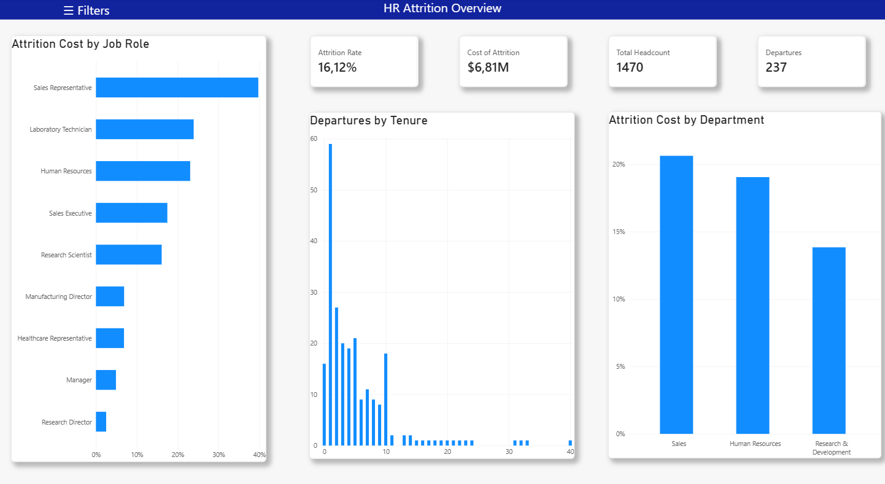
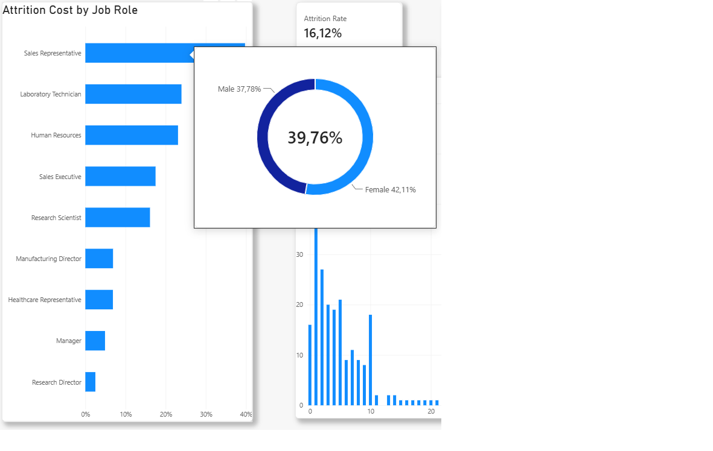
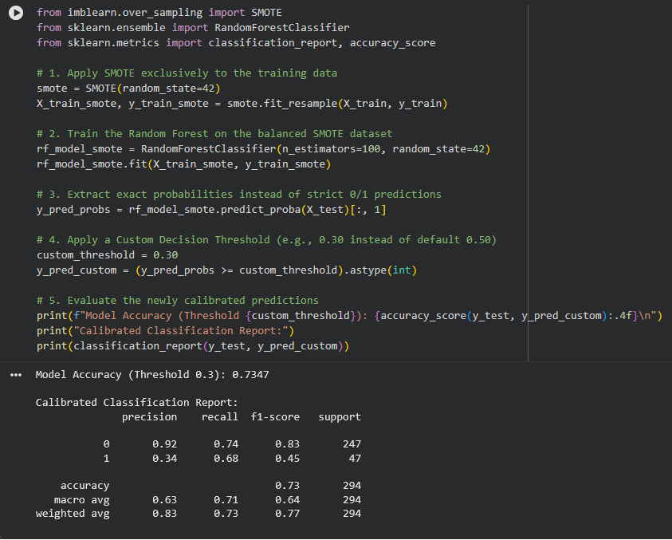
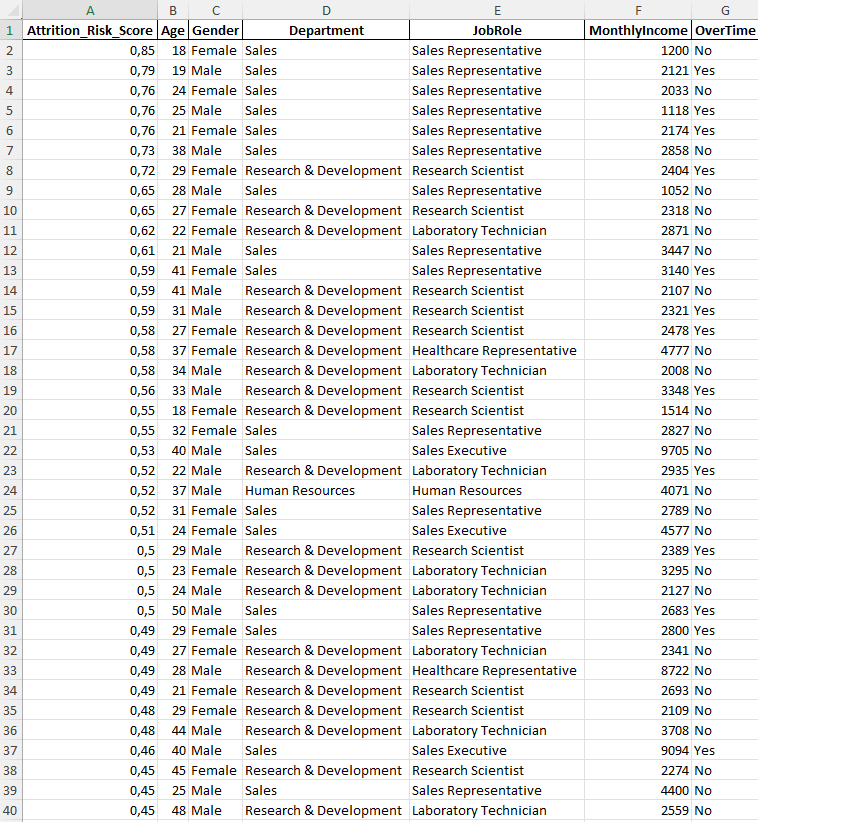
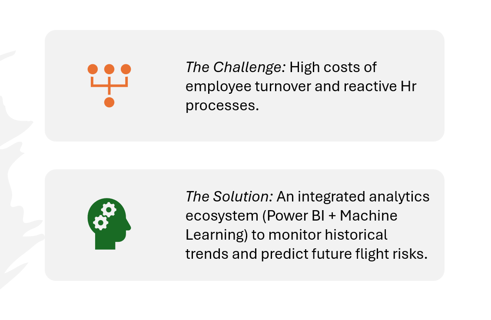

# HR Attrition Risk Analytics: End-to-End Data Pipeline & Predictive Modeling

## Executive Summary
This project demonstrates a complete, automated analytics pipeline designed to transition HR operations from reactive historical reporting to proactive retention. It integrates Data Engineering (Power Query, Star Schema), Business Intelligence (Advanced DAX, Power BI), and a Predictive Machine Learning ETL pipeline (Python, scikit-learn, Pandas) to identify high-risk employees and mitigate financial turnover losses.

### Quick Links
- [View Executive Presentation (PDF)](docs/HR_Attrition_Risk_Analytics_Presentation.pdf)

## System Architecture & Data Flow
To ensure scalability, the project was designed as a cohesive data ecosystem rather than isolated files:
1. Data Extraction & Transformation: Flat raw datasets are ingested into Power BI via Power Query, normalized, and modeled into a Star Schema.
2. Diagnostic Layer: Power BI leverages DAX to visualize historical trends and calculate current financial exposures.
3. Predictive ETL Pipeline: A decoupled Python/Pandas automated pipeline ingests raw data, performs feature engineering, runs the Random Forest classification, and outputs a Data Warehouse-ready dataset specifically filtered for business action.

## Project Walkthrough

### 1. Data Engineering & Diagnostic Analytics (Power BI)
The foundation of the visual reporting relies on robust data modeling and automated calculation engines, shifting away from flat-file processing.
- Power Query ETL: Extracted and cleaned the raw flat dataset, executing structural transformations to normalize the data.
- Dimensional Modeling: Designed a highly optimized Star Schema, separating quantitative metrics into `Fact_Attrition` and descriptive attributes into corresponding dimension tables (`Dim_Employee`, `Dim_Department`, `Dim_Role`).
- Advanced DAX Computations: Engineered complex measures utilizing `VAR`, `CALCULATE`, and context transition mechanisms to dynamically compute the $6.81M turnover cost and YoY retention metrics.

*Interactive Tooltip showcasing granular data on hover:*

### 2. Predictive ML & Automated Pandas ETL Pipeline (Python)
Moving beyond basic data cleansing, the predictive component operates as an automated Python-based ETL pipeline tailored for machine learning deployment.
- Feature Engineering & Preprocessing: Utilized Pandas and NumPy to encode categorical variables, scale numerical features, and handle missing data structures.
- Predictive Engine: Trained a Random Forest Classifier. Addressed the heavy class imbalance using SMOTE (Synthetic Minority Over-sampling Technique) on the training set.
- Business Calibration: Tuned the model's decision threshold to 0.30 to maximize recall, ensuring the capture of 68% of all potential leavers over strict precision.

### 3. Actionable Output: Automated HR Retention Pipeline
The final stage of the Python pipeline transforms raw ML probabilities into a business-ready deliverable.
- Automated Data Transformation: A Pandas script automatically joins the unencoded demographic data with the model's predicted probability scores.
- Output Generation: Filters profiles exceeding the >30% flight risk threshold and exports an aggregated, Data Warehouse-ready Excel report. This eliminates the need for manual data manipulation by the HR department.

### 4. Executive Presentation
All technical pipelines, DAX findings, and business recommendations were synthesized into a concise executive summary presentation for non-technical stakeholders.

## Repository Structure
- /data: Contains the raw data sources and the final automated export (Clean_HR_Risk_Report.xlsx).
- /notebooks: Contains the heavily documented Jupyter Notebook (HR_Attrition_Predictive_Model.ipynb) housing the Pandas ETL and ML pipeline.
- /docs: Contains the Executive Summary PDF and project architecture screenshots.
- / (Root): Power BI project files (.pbip, .Report, .SemanticModel) containing the Star Schema and DAX scripts.

## Deployment & Execution
1. Clone the repository.
2. Business Intelligence: Open HR_Attrition_Dashboard.pbip in Power BI Desktop to interact with the DAX measures and Star Schema model.
3. Predictive Pipeline
